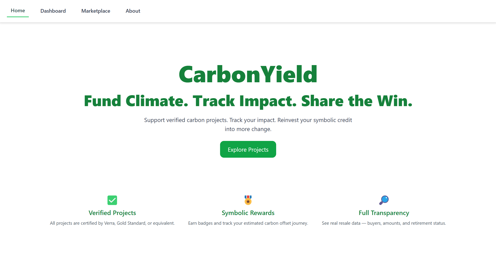
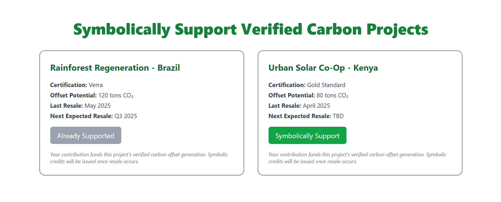

# 🌱 CarbonYield

> A climate-fintech web app for symbolic carbon credit investments — built to track impact, reward transparency, and reinvest hope.

---

## 🚀 Live Demo

🌐 [www.carbonyield.net](https://www.carbonyield.net)  
📂 [GitHub Repository](https://github.com/Almond-Sug/CarbonYield)

---

## 🌍 Project Overview

CarbonYield is a modern climate-tech platform enabling individuals to symbolically fund verified carbon sequestration projects and transparently track their environmental impact.

Unlike traditional carbon offset programs, CarbonYield emphasizes:

- **Symbolic reinvestment:** You don’t just donate — you gain credit to fund more change.
- **Transparency:** You see how your symbolic credits are issued, tracked, and retired.
- **Gamification:** Earn badges and track your carbon reduction journey.

---

## 🧠 Why This Matters

> There’s currently no transparent, trust-first tool that lets people participate meaningfully in the carbon credit space.  
> CarbonYield is an ethical alternative for those who want to fund climate action and see their impact evolve.

---

## 🔧 Tech Stack

- **Frontend:** React + Vite
- **Styling:** TailwindCSS v4
- **Routing:** React Router DOM
- **Deployment:** Netlify (auto-deploy from GitHub)
- **Charting:** Recharts (planned)
- **State & Logic:** React Hooks, localStorage (planned)

---

## 🖼️ Screenshots

---

## 🔄 Roadmap

### ✅ MVP Features (Completed)

- [x] Tailwind v4 + Vite setup
- [x] Modular layout with landing, dashboard, marketplace
- [x] Impact map component
- [x] Symbolic credit framing and UI
- [x] Responsive styling pass (in progress)

### 🧭 Next Milestones

- [ ] Symbolic Yield Calculator
- [ ] Portfolio Impact Chart (Pie + Line)
- [ ] Activity Log (symbolic events)
- [ ] Badge System & Achievements
- [ ] Reinvestment Credits Simulation
- [ ] Firebase Integration for MVP backend
- [ ] OAuth Authentication (GitHub/Google)

---

## 🤝 Contributing

This is a collaborative open MVP.  
Feel free to fork or clone the repo and try building symbolic extensions, visualizations, or open APIs.

---

## 📜 License

MIT License — feel free to reuse with attribution.

---

## 🙌 Built By

CarbonYield was developed by a climate-focused engineering team committed to creating transparent, ethical tools for impact.

Made with ☕, ☁️, and 🌱 by Almond Sugumalwang and collaborators.
