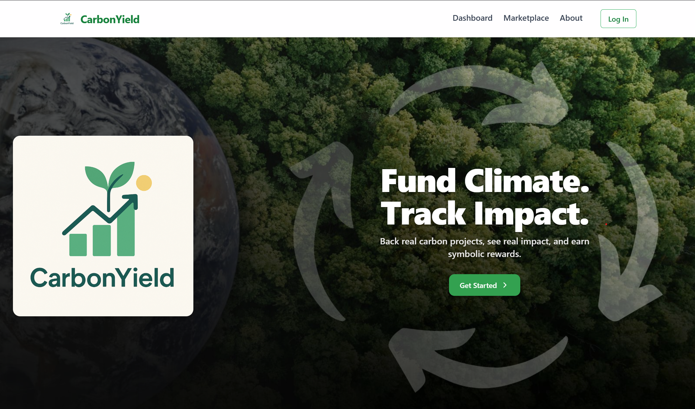

# CarbonYield 🌍

carbonyield.netlify.app

**Symbolic Climate Contribution Platform** — fund verified carbon offset projects, earn symbolic credits, and reinvest your impact transparently.

### 🔗 Live Demo
[carbonyield.netlify.app](https://carbonyield.netlify.app)

### 🛠 Tech Stack
- React + Vite
- TailwindCSS v4
- React Router DOM
- Recharts, Mapbox

### 📸 Preview

### 🚧 Roadmap
- Symbolic reinvestment flow (in progress)
- Dynamic project data from backend
- OAuth user accounts

---

Let me know once you’ve done this, and I’ll help you:
- Write your resume bullet point
- Write a one-liner for LinkedIn
- Draft a short post to share it as a portfolio highlight

Would you like to proceed with that next?
